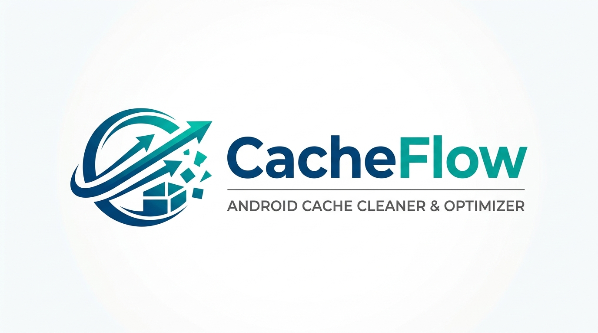

# CacheFlow (Android Cache Cleaner)



CacheFlow est une application utilitaire Android moderne développée avec Flutter, conçue pour analyser intelligemment l'utilisation du stockage et automatiser le nettoyage des caches des applications tierces.

## 🚀 Vision du Projet

L'objectif de CacheFlow est d'offrir une solution simple et efficace pour libérer de l'espace de stockage sur Android, en supportant deux modes de fonctionnement :
- **Mode Non-Root :** Automatisation du nettoyage via les **Services d'Accessibilité**.
- **Mode Root :** Nettoyage direct via des commandes shell pour une efficacité maximale.

## ✨ Fonctionnalités Clés

- **🔍 Analyse du Stockage (F1) :** Liste complète des applications installées avec récupération précise des tailles de cache, de données et de l'APK via `StorageStatsManager`.
- **🤖 Mode Accessibilité (F2) :** Automatisation du parcours des paramètres système pour vider le cache des applications sélectionnées sans intervention manuelle répétitive.
- **⚡ Mode Root (F3) :** Nettoyage instantané des répertoires `/cache` et `/data/user/0/*/cache` pour les utilisateurs avancés.
- **🎨 Interface Material 3 (F4) :** Dashboard intuitif avec visualisation graphique des statistiques de stockage et bouton "Nettoyage Rapide".

## 🛠 Architecture & Stack Technique

Le projet respecte les principes de la **Clean Architecture** pour garantir une base de code robuste et testable :

- **Framework :** Flutter 3.x
- **Architecture :** Clean Architecture (Data, Domain, Presentation)
- **Gestion d'État :** [BLoC](https://pub.dev/packages/flutter_bloc)
- **Injection de Dépendances :** [GetIt](https://pub.dev/packages/get_it) & [Injectable](https://pub.dev/packages/injectable)
- **Base de Données Locale :** Isar
- **Bridge Natif :** MethodChannels (Dart <-> Kotlin) pour l'interaction avec les API système Android.

### Structure du Projet

```text
lib/
├── core/              # Utilitaires, constantes, thèmes
├── data/              # Implémentations (Sources de données, Models, Repositories)
├── domain/            # Logique métier pure (Entities, Usecases, Interfaces)
└── presentation/      # UI (BLoC, Pages, Widgets)
```

## 🔐 Permissions Requises

Pour fonctionner correctement, CacheFlow nécessite les autorisations suivantes :
- `PACKAGE_USAGE_STATS` : Pour accéder aux statistiques de stockage des applications.
- `QUERY_ALL_PACKAGES` : Pour lister les applications installées (Android 11+).
- `BIND_ACCESSIBILITY_SERVICE` : Pour automatiser le nettoyage en mode non-root.

## ⚙️ Installation & Configuration

### Prérequis
- Flutter SDK (3.x ou plus)
- Android Studio / Android SDK
- Un appareil Android (physique ou émulateur)

### Étapes
1. **Cloner le projet :**
   ```bash
   git clone <url-du-repo>
   cd android_cache_cleaner
   ```

2. **Installer les dépendances :**
   ```bash
   flutter pub get
   ```

3. **Générer le code (Injectable/Isar) :**
   ```bash
   dart run build_runner build --delete-conflicting-outputs
   ```

4. **Lancer l'application :**
   ```bash
   flutter run
   ```

---
*Développé avec ❤️ pour une expérience Android plus fluide.*
