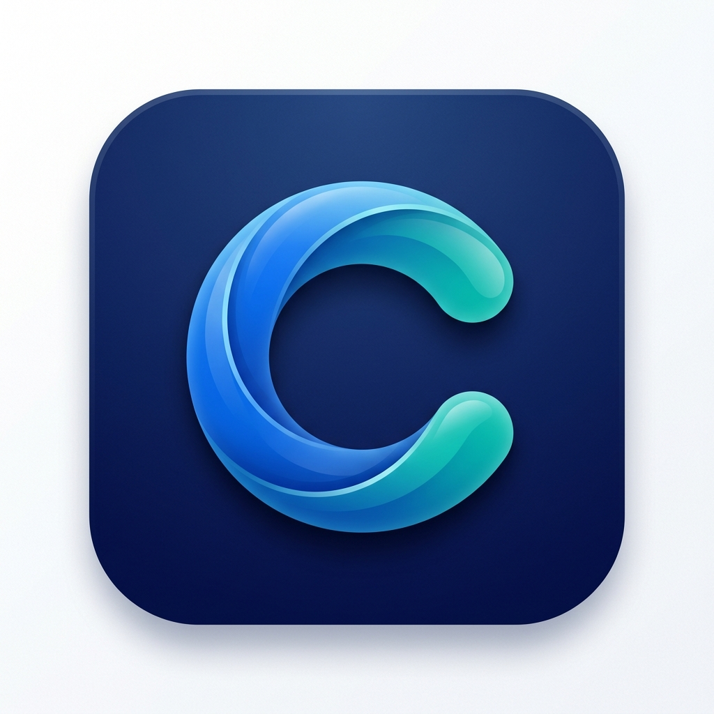

# CacheFlow (Android Cache Cleaner)

<div align="center">
  
  <br><br>
  
  [](https://www.gnu.org/licenses/gpl-3.0)
  [](https://flutter.dev)
  [](https://www.android.com)
  [](https://github.com/ellerbrock/open-source-badges/)
</div>

CacheFlow est une application utilitaire Android moderne et **Open-Source** développée avec Flutter. Elle est conçue pour analyser intelligemment l'utilisation du stockage et automatiser le nettoyage des caches des applications tierces, offrant une expérience fluide et transparente.

> *Note : L'identifiant de package officiel est `com.sahraouilarbi.android_cache_cleaner`.*

## 🚀 Vision du Projet

L'objectif de CacheFlow est de redonner le contrôle aux utilisateurs sur leur stockage Android via une solution éthique, sans trackers et performante :
- **Mode Non-Root :** Automatisation du nettoyage via les **Services d'Accessibilité** (simule les clics utilisateur).
- **Mode Root :** Nettoyage direct et instantané via des commandes shell `su`.

## ✨ Fonctionnalités Clés

- **🔍 Analyse du Stockage :** Liste complète des applications avec détails (Cache, Données, APK) via `StorageStatsManager`.
- **🤖 Automatisation :** Nettoyage intelligent sans répétition manuelle pour les utilisateurs non-root.
- **⚡ Performance :** Support du mode Root pour un nettoyage en un clic.
- **🎨 Design Material 3 :** Interface moderne, support natif des thèmes **Clair et Sombre**.
- **🌍 Multilingue :** Support complet du **Français**, **Anglais** et **Arabe** (incluant le support RTL).

## 📖 Guide d'Utilisation

### 1. Autoriser l'accès aux statistiques
Au premier lancement, l'application vous demandera l'autorisation **"Accès aux données d'utilisation"**. Elle est indispensable pour calculer la taille réelle du cache de chaque application.
- Cliquez sur "Autoriser" dans la boîte de dialogue.
- Cherchez **CacheFlow** dans la liste des paramètres Android qui s'affiche.
- Activez l'option **"Autoriser l'accès aux données d'utilisation"**.

### 2. Activer le Service d'Accessibilité (Mode Non-Root)
Pour automatiser le nettoyage sans accès Root, CacheFlow a besoin de simuler des clics dans les menus système.
- Cliquez sur le bouton **"Nettoyer tout le cache"** sur le tableau de bord.
- Si le service n'est pas actif, vous serez redirigé vers les paramètres d'**Accessibilité**.
- Allez dans **"Applications installées"** (ou "Services téléchargés").
- Sélectionnez **CacheFlow** et activez l'interrupteur.
- Acceptez l'avertissement système (CacheFlow n'utilise cette permission *que* pour cliquer sur le bouton "Vider le cache").

### 3. Lancer le nettoyage
Une fois les permissions accordées :
- Cliquez sur le bouton flottant **"Nettoyer tout le cache"**.
- L'application va alors parcourir automatiquement la liste des applications.
- Laissez votre téléphone travailler quelques secondes. Il reviendra sur CacheFlow une fois terminé.

## 🛠 Architecture & Stack Technique

Le projet suit rigoureusement la **Clean Architecture** :

- **Framework :** Flutter 3.x (Dart)
- **State Management :** BLoC
- **DI :** GetIt & Injectable
- **Localisation :** arb files with flutter_localizations
- **Bridge :** Kotlin MethodChannels pour les API système (`StorageStatsManager`, `AccessibilityService`).

```text
lib/
├── core/              # Utilitaires, thèmes, injection
├── data/              # DTOs, Repositories implementations
├── domain/            # Entities, Usecases, Repository interfaces
├── l10n/              # Fichiers de traduction (ARB)
└── presentation/      # BLoCs, Pages, Widgets
```

## 🔐 Permissions Android

- `PACKAGE_USAGE_STATS` : Analyse du stockage.
- `QUERY_ALL_PACKAGES` : Liste des applications (Android 11+).
- `BIND_ACCESSIBILITY_SERVICE` : Automatisation du nettoyage.

## ⚙️ Installation

1. **Cloner le projet :**
   ```bash
   git clone https://github.com/sahraouilarbi/android_cache_cleaner.git
   ```
2. **Setup Flutter :**
   ```bash
   flutter pub get
   dart run build_runner build --delete-conflicting-outputs
   flutter gen-l10n
   ```
3. **Lancer :**
   ```bash
   flutter run
   ```

## 🧪 Tests

Le projet inclut une suite de tests unitaires et de widgets pour garantir la stabilité :
```bash
flutter test
```

## 🤝 Contribution

Les contributions sont les bienvenues ! Que ce soit pour signaler un bug, proposer une fonctionnalité ou améliorer le code :
1. Forkez le projet.
2. Créez votre branche (`git checkout -b feature/AmazingFeature`).
3. Committez vos changements (`git commit -m 'Add AmazingFeature'`).
4. Pushez sur la branche (`git push origin feature/AmazingFeature`).
5. Ouvrez une Pull Request.

## 📄 Licence

Distribué sous la licence **GNU GPL v3**. Voir le fichier `LICENSE` pour plus d'informations.

---
*Fait avec ❤️ par Larbi Sahraoui. CacheFlow est un logiciel libre.*
